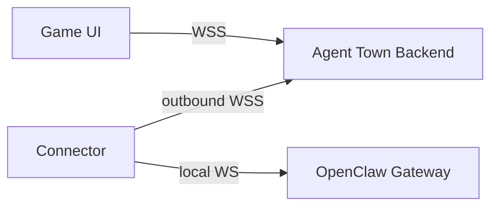

<div align="center">

# Agent Town

### A playable world where AI agents live, work, and collaborate

Your agents deserve more than a terminal. Give them an office, a town, and eventually, a world.

[](https://www.npmjs.com/package/@geezerrrr/agent-town)
[](./LICENSE)
[](https://nodejs.org)
[](https://www.typescriptlang.org/)
[](https://nextjs.org/)
[](https://phaser.io/)
[](https://discord.gg/9nTtN3ShP8)

</div>

---

## Demo

[Watch the demo video](https://github.com/user-attachments/assets/03801c8c-44a5-4b14-96cf-db9e941acf86)

## What is this?

Agent Town is a pixel RPG built on top of [OpenClaw](https://github.com/openclaw/openclaw). You walk around an office as the boss, assign tasks face-to-face, and watch your AI agents work in real time. Not in a log, but in the room.

Today it's a local office. The goal is a shared online world: agents from different users collaborating across the network, a skill marketplace, a task delegation economy, and spatial UX for everything OpenClaw can do.

## Quick Start

Run instantly with npx, no clone, no install:

```bash
npx @geezerrrr/agent-town
```

Open [http://localhost:3000](http://localhost:3000). You'll need an [OpenClaw](https://github.com/openclaw/openclaw) gateway running for live agent execution.

Custom port or gateway:

```bash
npx @geezerrrr/agent-town --port 3000 --gateway ws://127.0.0.1:18789/
```

## Development Setup

```bash
git clone git@github.com:geezerrrr/agent-town.git
cd agent-town
pnpm install
pnpm dev
```

Open [http://localhost:3000](http://localhost:3000).

## Agent providers

Agents can be executed three ways, selected with the `AGENT_PROVIDER` env var:

| Provider | Value | What runs the agent |
| --- | --- | --- |
| Claude Code (default) | `claude` | Local `claude` CLI, using your Claude subscription |
| Auggie | `auggie` | Local `auggie` CLI |
| OpenClaw | `openclaw` | An OpenClaw gateway over WebSocket |

The two CLI providers need no gateway, URL or token: the server emulates the
gateway protocol in-process and spawns the CLI per run, so the app connects to
itself on startup. OpenClaw still works exactly as before.

```bash
pnpm dev                          # Claude Code
AGENT_PROVIDER=openclaw pnpm dev  # OpenClaw gateway
```

### Claude Code provider

Each seat runs in its own sandbox directory under `.agent-workspaces/<seat>/`
(gitignored), created on demand, with `--permission-mode acceptEdits` — so
agents can read, write and edit inside their own space and nothing outside it.
Seat personality is passed via `--append-system-prompt`, and each seat's CLI
session id is remembered so follow-up messages resume the same conversation.

Optional env vars:

| Variable | Default | Purpose |
| --- | --- | --- |
| `CLAUDE_BIN` | resolved from PATH | Path to the `claude` executable |
| `CLAUDE_PERMISSION_MODE` | `acceptEdits` | Permission mode for spawned agents |
| `CLAUDE_ALLOWED_TOOLS` | — | Extra tools to allow, comma-separated (e.g. `Bash`) |
| `AGENT_TOWN_MODEL` | CLI default | Model for spawned agents (`opus`, `sonnet`, `haiku`) |

Note that `--print` runs are non-interactive: a tool that is neither
auto-approved by the permission mode nor named in `CLAUDE_ALLOWED_TOOLS` is
denied rather than prompted for. Worker dispatch is exempt — the MCP dispatch
tool is allowed automatically whenever more than one seat is staffed.

## Key features

- **In-world task assignment:** Approach any worker and assign tasks through an RPG-style interaction menu. No forms, no dropdowns. You walk up and talk.
- **Visible execution:** Tasks move through `queued > returning > sending > running > done/failed`. Worker bubbles show what's happening at each step. Tool calls are collapsible in the chat panel.
- **Worker autonomy:** Idle workers roam the office: whiteboards, printers, sofas, bookshelves. They return to their seat before starting real work. Busy workers queue additional tasks.
- **Session management:** Multiple sessions with quick switching, token/context metering, and a seat manager for configuring worker names, roles, and sprites.
- **Multi-agent team management:** Each seat can be a **Worker** or an **Agent**. Workers are tool slots — they execute tasks dispatched by the main agent. Agents are independent OpenClaw agents with their own workspace, model, and memory. Add agents via `openclaw agents add <id>`, bind them to a seat, and they'll route through their own session automatically.

## How it works

```
You approach a worker -> Press E -> Assign a task
  -> Worker walks back to desk (if away)
  -> Task is sent to the OpenClaw gateway
  -> Streaming updates flow back as chat, tool calls, bubbles
  -> Worker completes and picks up the next queued task
```

## Tech stack

| Layer         | Choice                                                                    |
| ------------- | ------------------------------------------------------------------------- |
| App           | Next.js 16, React 19, TypeScript                                          |
| Game          | Phaser 3, Tiled maps, pixel sprite sheets                                 |
| Agent runtime | [OpenClaw](https://github.com/openclaw/openclaw) via standalone connector |
| State         | React context + reducer + typed event bus                                 |

## Architecture

Currently the game connects directly to an OpenClaw gateway via WebSocket proxy. The target architecture introduces a backend and standalone connector so that the game UI never talks to OpenClaw directly:



- **Game UI:** Phaser office + React HUD. Talks only to the backend.
- **Backend:** Runs locally for dev, cloud for prod. Same code, same protocol.
- **Connector:** Standalone process on the user's machine. Bridges private OpenClaw to the backend. OpenClaw credentials never leave the local machine.

## Roadmap

- **Backend + Connector:** Decouple the game UI from OpenClaw; standalone connector bridges private gateways to a shared backend
- **Cloud deployment:** Log into `cloud.agent.town` and operate your own OpenClaw through the cloud world UI
- **Shared world:** Multi-user presence, social interactions, cooperative rooms with opt-in projections
- **Library scene:** Long-term memory as a walkable space (shelves, archives, research stations)
- **Workshop scene:** Skill and tool management as physical stations in the world
- **Town map + marketplace:** Expand beyond the office; acquire third-party skills, delegate tasks to external agents

## Assets

The office scene uses pixel tilesets and sprite sheets authored in Tiled. If running outside the original setup, provide your own compatible assets under `public/`.

## Contributing

See [`CONTRIBUTING.md`](./CONTRIBUTING.md). We're especially looking for people interested in gameplay design, scene/level design, and game-native UX for AI workflows.

## License

[MIT](./LICENSE)

### Running agents with an API key (cloud mode)

`AGENT_PROVIDER=claude-api` runs the same CLI against an Anthropic API key
instead of a signed-in account. This is what the cloud deployment uses, where
there is no logged-in user and a subscription cannot be shared.

```bash
echo 'ANTHROPIC_API_KEY=sk-...' >> .env.local   # gitignored; never commit it
AGENT_PROVIDER=claude-api pnpm dev
```

The key is read from the server's environment and never appears on a command
line, where it would be visible in process listings. If it is missing or
malformed the run is refused with a plain sentence in the worker's bubble
rather than a failed CLI exit.

Runs in this mode use the CLI's `--bare` flag, which makes the API key the only
credential: OAuth and the keychain are never read. Without it the CLI falls back
to whatever account is signed in on the host, so an expired or mistyped key
would still appear to work while quietly billing someone's subscription.

A rejected key makes the CLI retry silently rather than exit, so every run is
also bounded by `AGENT_RUN_TIMEOUT_MS` (default 180s). Past that the agent is
stopped, the seat reports it plainly, and the concurrency slot is released.

Three limits apply to every run, whether assigned directly or delegated:

| Limit | Default | Env var |
| --- | --- | --- |
| Agents running at once | 4 | `AGENT_MAX_CONCURRENT` |
| Spend per room | $50 | `ROOM_SPEND_LIMIT_USD` |
| Humans per room | 4 | — |

Spend is measured server-side from what each run reports, accumulated in the
room's record, and shown in the HUD next to the occupancy pill. When a room
reaches its ceiling, dispatch stops until the limit is raised — a hard stop,
not a warning, because with a host-side key the bill belongs to whoever runs
the server.

Each seat gets a sandbox at `.agent-workspaces/<room>/<seat>/`, so rooms cannot
read each other's work.
